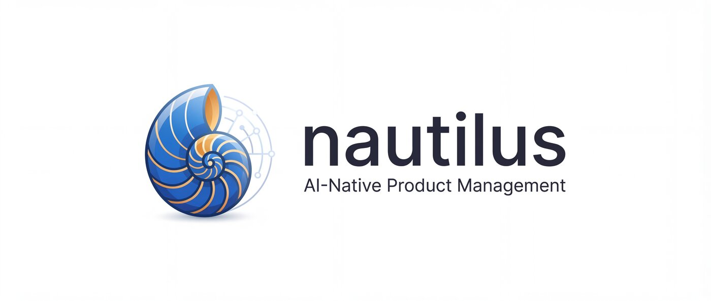

<p align="center">
  
</p>

An AI-native product discovery system for Cursor workflows. Connects hypotheses, validation, and PRDs directly to your codebase — so your AI coding assistant has the full context from business problem to implementation.

## The Problem with Product Discovery Today

Most product discovery lives in Notion, Figma comments, and Slack threads. That works fine for humans — but when you hand a PRD to an AI coding assistant, it has no idea *why* those decisions were made, what alternatives were tried, or what assumptions haven't been tested yet.

The context gap between "what to build" and "build it" is where products go wrong. And in AI-native development, that gap is even more expensive — because the LLM will confidently build the wrong thing with no way to course-correct.

## What Nautilus Does

Nautilus keeps the entire discovery trail in your repo, right next to the code:

```
Business Problem
      ↓
  Hypothesis        ← what we believe and why
      ↓
  Validation        ← how we tested it, what we learned
      ↓
     PRD            ← traceable to evidence, not assumptions
      ↓
  Implementation    ← AI coding assistant sees the full history
```

Every user story in a PRD traces back to validated hypotheses. Every hypothesis has a record of how it was tested. The confidence threshold scales with cost and reversibility — a feature flag experiment needs less proof than a platform migration.

Nothing gets built on vibes alone — but the process isn't heavyweight either. It's hypothesis-driven development with the rigor tuned to what's at stake.

## Requirements

- [Cursor](https://cursor.com)
- Node.js (for npx installer only — not required if cloning)

## Installation

### Option A: npx (recommended)

```bash
cd your-project
npx nautilus-kit install
```

This copies `.agents/skills/` and `.cursor/agents/` into your project and creates a `.nautilus-manifest.json` for tracking managed files. You may want to add `.nautilus-manifest.json` to your `.gitignore`.

### Option B: Clone

```bash
git clone https://github.com/shinpr/nautilus.git
cp -r nautilus/.agents your-project/
cp -r nautilus/.cursor your-project/
```

### Updating

When a new version is released:

```bash
# Preview what will change
npx nautilus-kit update --dry-run

# Apply updates
npx nautilus-kit update
```

Files you've modified locally are preserved — the updater only touches files that match the previously installed version. New files are added automatically.

```bash
# Check installed version
npx nautilus-kit status
```

## Usage

Recipes are Cursor Agent Skills — invoke them by typing `/recipe-vision`, `/recipe-discover`, etc. in Cursor chat.

This is not a linear process — it's a cycle. You can start from anywhere and loop back as you learn.

```
     Discover → Validate → Define → Implement
         ↑                              |
         └──────── Reflect ◀────────────┘
```

Reflect is not something you do at the end. You run it every time validation results come in. The learnings it accumulates make each round of Discovery sharper.

### Starting a new product

1. **`/recipe-vision`** — Define your product vision, outcomes (business and product), and North Star Metric. Also set 3-5 design principles specific to your product.

2. **`/recipe-persona`** — Create your first personas. Define who you're building for: their jobs-to-be-done, pains, gains, and behavioral patterns.

3. **`/recipe-discover`** — Discover opportunities from two angles: business (market size, competitive landscape, business model) and user (pain points, unmet needs, journey gaps). Generates hypotheses with validation methods and time budgets.

4. **`/recipe-validate`** — Test each hypothesis with the method that fits its risk type:
   - **Value risk** → market research, competitive analysis, user interviews
   - **Usability risk** → prototype testing (Nautilus generates prompts with your design context baked in — paste them into [Lovable](https://lovable.dev), [v0](https://v0.dev), or any prototyping tool)
   - **Feasibility risk** → code spikes, architecture review
   - **Viability risk** → business model analysis, ROI calculation

5. **`/recipe-reflect`** — After each round of validation, run a reflection. It extracts learnings from your results, spots patterns across hypotheses, and builds up your product knowledge base.

6. **`/recipe-define`** — When hypotheses are validated enough, turn them into a PRD. Each user story shows its confidence scores and remaining risks. The PRD is ready for handoff to your implementation workflow.

### Adding to an existing product

1. **`/recipe-vision`** — Articulate the vision and outcomes for what already exists.
2. **`/recipe-persona`** — Document your current users. If you have a codebase, the codebase-analyzer reports what's actually built today.
3. **`/recipe-discover`** — The codebase-analyzer objectively reports what exists today. Opportunities emerge from the gap between current state and where you want to be. From here, the cycle is the same.

### Day-to-day patterns

**Exploring a new feature idea:**
`/recipe-discover` → `/recipe-validate` → `/recipe-reflect` → `/recipe-define`

**User feedback came in:**
`/recipe-discover` with the feedback as input → update existing opportunities or discover new ones

**Validation results are in:**
`/recipe-validate` to record results → `/recipe-reflect` to extract learnings → if confidence is high enough, `/recipe-define`

**Testing usability with a prototype:**
`/recipe-validate` generates a prompt with your design principles, persona, and hypothesis baked in. Paste it into Lovable or v0. Test the prototype, then record results back in `/recipe-validate`.

**Quarterly review or post-launch retro:**
`/recipe-reflect` at the Vision level — reassess whether your outcomes and NSM are still right based on everything you've learned.

## How It Works

### Workflow recipes

| Command | What it does |
|---------|-------------|
| `/recipe-vision` | Define or update product vision, outcomes, and North Star Metric |
| `/recipe-persona` | Create or update personas with JTBD integration |
| `/recipe-discover` | Find opportunities, generate hypotheses from business + user angles |
| `/recipe-validate` | Test hypotheses with type-appropriate methods |
| `/recipe-define` | Turn validated hypotheses into a PRD with confidence scores |
| `/recipe-reflect` | Run retrospectives, distill learnings, update the knowledge base |

Each recipe has **stop points** where it pauses for your input before proceeding. You stay in control of every key decision.

### Foundational skills

These skills provide the frameworks and principles that shape product decisions. Cursor loads them automatically when the conversation context matches:

| Skill | What it does |
|-------|-------------|
| `product-principles` | 4 Risks framework (Value, Usability, Feasibility, Viability), OST hierarchy, knowledge tiers |
| `hypothesis-discipline` | Hypothesis lifecycle, confidence scoring, time budgets |
| `design-perspective` | Design principles, state design (loading/empty/error), WCAG 2.2 AA |
| `prototype-guide` | Design context injection for prototype generation prompts |
| `business-context` | BMC, Value Proposition Canvas, market analysis frameworks |

### Subagents (`.cursor/agents/`)

Four specialized agents handle tasks where **context separation matters** — they run in isolated sessions to eliminate the biases that come from reviewing your own work:

| Agent | Why it's separate |
|-------|------------------|
| `doc-reviewer` | Reviews PRDs without the author's "I wrote it, so it's correct" bias |
| `codebase-analyzer` | Reports facts about existing code without being influenced by the current hypothesis |
| `hypothesis-verifier` | Designs validation tests that can actually *disprove* the hypothesis (confirmation bias is real) |
| `knowledge-distiller` | Looks across all hypotheses to find patterns, not just the ones you're focused on |

Context separation is a deliberate design choice. Cursor's subagent architecture makes it possible to give each agent a clean context window — no carry-over from the session that generated the artifact being reviewed.

### Knowledge architecture

As hypotheses accumulate, you can't read everything every time. Nautilus manages this with three tiers:

- **Tier 1** (`docs/product/learnings.md`) — Distilled principles from 3+ validated hypotheses. Loaded every session. A few dozen lines that capture what your team has learned.
- **Tier 2** (within each Opportunity file) — Learnings specific to a problem area. Loaded when you're working in that area.
- **Tier 3** (`docs/discovery/hypotheses/`) — Raw hypothesis files with full evidence. Referenced on demand.

Learnings get promoted up the tiers as evidence accumulates. Stale insights (6-12 months without revalidation) get flagged.

## Repo Structure

```
your-project/
├── .agents/skills/          # Skills and workflow definitions
├── .cursor/agents/          # Subagent specifications
└── docs/                    # Created as you use the recipes
    ├── product/             # Vision, personas, design principles, learnings
    ├── discovery/           # Opportunities, hypotheses, journeys, prototypes
    │   └── INDEX.md         # Auto-generated summary of discovery status
    ├── prd/                 # PRDs (ready for development)
    ├── design/              # Design Docs
    ├── adr/                 # Architecture Decision Records
    ├── ui-spec/             # UI Specifications
    └── plans/               # Work Plans
```

## Why Keep Discovery in Your Repo

**Why keep discovery in the repo?** AI coding assistants work best when they can access all relevant context. When hypotheses, validation results, and PRDs live alongside code, the LLM has the full picture — from "why are we building this" to "how is it implemented." Repo is the one place every tool in the chain can read.

**Why Cursor skills?** Product discovery isn't a separate activity from development — it's the upstream part of the same flow. Skills and subagents let the AI handle structured, hypothesis-driven workflows while you keep using the editor you already know.

**Why subagents for review?** When the same session creates a document and reviews it, the review is generous. Separate agents with fresh context catch what the creator misses. Same reason code review exists.

**Why confidence thresholds instead of binary validation?** A $500 feature behind a feature flag needs less proof than a platform migration. The Confidence Meter (0-10) lets you match rigor to risk.

## Connecting to Implementation

Nautilus produces PRDs designed to flow directly into LLM-powered implementation workflows. The PRD format, along with Design Docs, ADRs, UI Specs, and Work Plans, follows conventions that AI coding assistants can pick up and execute — from design through implementation and testing.

Nautilus handles everything up to the PRD. From there, hand it to your AI coding assistant or any LLM-powered implementation workflow — with full traceability back to the evidence that justified building it.

## License

MIT
